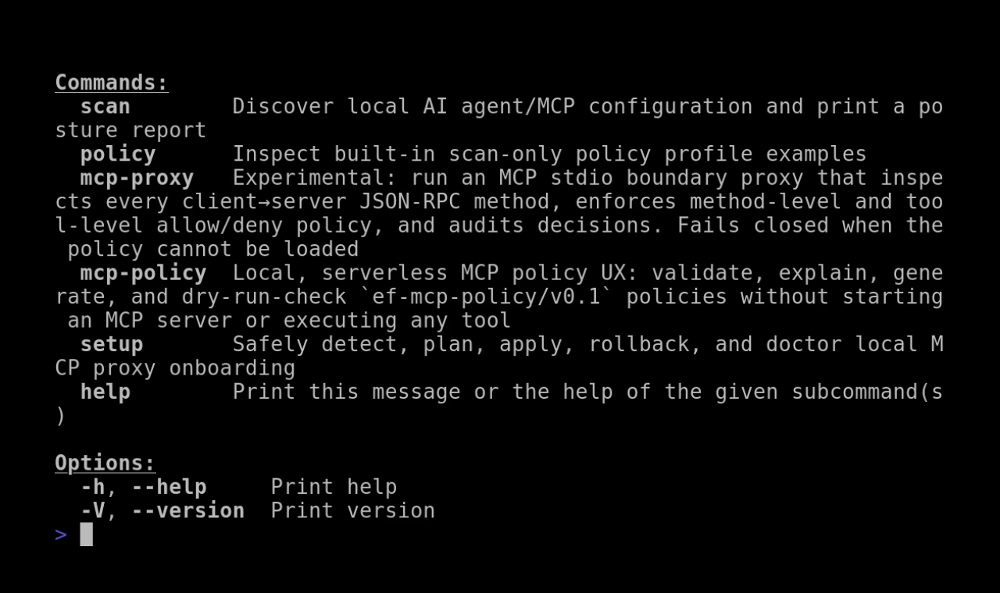

<p align="center">
  
</p>

<h1 align="center">EtherFence</h1>

<p align="center">
  <strong>AI Agent Security Posture &amp; Runtime Control</strong>
</p>

<p align="center">
  See what your AI agents can access.<br>
  Control what their MCP servers are allowed to do.
</p>

<p align="center">
  Local-first · Open source · No cloud control plane · Fail-closed runtime enforcement
</p>

<p align="center">
  <a href="https://github.com/Etherisys/etherfence/releases"></a>
  <a href="https://github.com/Etherisys/etherfence/actions/workflows/ci.yml"></a>
  <a href="LICENSE"></a>
  <a href="Cargo.toml"></a>
  <a href="docs/mcp-proxy-operator-guide.md"></a>
  <a href="docs/install.md"></a>
</p>

<p align="center">
  <a href="#quick-start">Quick Start</a> ·
  <a href="#what-etherfence-protects">Protection</a> ·
  <a href="#demo">Demo</a> ·
  <a href="docs/install.md">Install</a> ·
  <a href="docs/mcp-proxy-operator-guide.md">MCP Proxy</a> ·
  <a href="docs/roadmap.md">Roadmap</a> ·
  <a href="CONTRIBUTING.md">Contributing</a>
</p>

---

## Protect your AI-agent environment in three steps

| 1. Discover | 2. Assess | 3. Control |
| --- | --- | --- |
| Find local agent and MCP configurations | Identify capability, identity, and integrity risks | Enforce least-privilege MCP runtime policy |
| `etherfence scan` | `etherfence setup detect` | `etherfence mcp-proxy` |

<h2 align="center">See EtherFence in action</h2>

<p align="center">
  
</p>

<p align="center">
  Discover local AI-agent risks, assess MCP server posture, and validate
  deny-by-default runtime policies — all from the real <code>etherfence</code> binary.
</p>

The recording runs the real `etherfence` binary against checked-in fixtures
in three scenes:

- **Identity + posture scan** — `etherfence scan` prints the colored
  ETHERFENCE splash, then discovers a Claude Code filesystem MCP server
  with broad filesystem access
- **Setup assessment** — `etherfence setup detect` reports capability,
  trust indicators, and a deny-by-default starter-policy recommendation
- **Policy decision preview** — `etherfence mcp-policy check` denies an
  unauthorized `filesystem.write` request without starting any server

The configured `npx` filesystem server is parsed, never executed. No network
access, package installation, or live MCP server contact is required.

The demo workspace, VHS tape, and generation/verification scripts live in the
`demo/` directory of the repository source tree (not shipped in release
artifacts). To reproduce the recording locally, check out the repository and
run `./demo/run-demo.sh` (requires VHS, ttyd ≥ 1.7.2, ffmpeg, and DejaVu Sans
Mono). Verify the underlying behavior without VHS via `./demo/verify-demo.sh`.
[View HD recording](docs/assets/etherfence-demo.mp4).

## What EtherFence protects

| Area | EtherFence today |
| --- | --- |
| AI-agent/MCP config posture on this machine | **Reports** — `scan` discovers config files and reports risk hints (read-only, no enforcement) |
| MCP stdio traffic to a server explicitly wrapped with `mcp-proxy` | **Protects** — method/tool/path allow-deny enforcement, fail-closed on policy errors |
| MCP proxy policy authoring and review | **Protects** — `mcp-policy` validates, explains, and dry-runs policies locally |
| MCP servers *not* wrapped by `mcp-proxy` | **Not protected** — traffic passes through however the server/client normally talk |
| Non-stdio MCP transports (HTTP/SSE) | **Not supported** |
| Terminal commands | **Out of scope** — pairs with [Tirith](https://github.com/Etherisys) as complementary terminal-command protection |

<details>
<summary><strong>Security boundaries and non-goals</strong></summary>

EtherFence is intentionally local and scoped. It does not include daemon mode,
an API service, a control plane, endpoint agents, shell hooks, terminal-command
scanning, network/TLS interception, DLP/content inspection, or cloud dependency.

| Boundary | What to expect |
| --- | --- |
| Network or TLS traffic | **Never intercepted** |
| File, prompt, or tool-result content | **Never inspected** — no DLP or content-inspection engine |
| Running processes, registries, remote/managed configs | **Not read** — `scan` only reads known local config files |
| Unwrapped MCP servers | **Not controlled** — wrap stdio servers with `mcp-proxy` to enforce runtime policy |

See [Security model / non-goals](#security-model--non-goals) below and
[`docs/threat-model.md`](docs/threat-model.md) for the full boundary model.

</details>

## Who this is for

Developers and teams running AI coding agents (Claude Code, Cursor, VS Code,
Windsurf, Gemini CLI, Codex CLI) or MCP servers locally, who want visibility
into what those agents/configs expose, and an optional local boundary around
one MCP server's traffic — without adopting a daemon, a cloud service, or a
new terminal workflow.

## What EtherFence does

Three local commands, each with a distinct job:

- **`etherfence scan`** — posture discovery and a CI gate. Conservatively
  discovers local AI-agent/MCP configuration files and reports risk hints
  (broad filesystem access, shell-capable MCP servers, network-capable MCP
  servers, secret-looking environment variables, and more) with rationale,
  impact, and remediation guidance. Supports baselines, TOML policy
  profiles, `--fail-on`/`--fail-on-new` CI gates, and JSON/Markdown/SARIF
  output.
- **`etherfence mcp-proxy`** — a local MCP runtime boundary. A stdio proxy
  that sits between an MCP client and one MCP server, enforces
  method-level, tool-level, and path-aware allow/deny policy, and audits
  decisions. Fails closed on any policy problem. See the
  [operator guide](docs/mcp-proxy-operator-guide.md) for how to wrap a real
  server with it.
- **`etherfence mcp-policy`** — policy authoring, validation, explanation,
  and dry-run. `validate`/`explain`/`init`/`check` read and reason about an
  `mcp-proxy` policy file without ever starting or contacting an MCP server.

## Quick start

Run the guided setup wizard:

```sh
# 1. Install or build (see docs/install.md for release artifacts).
cargo build --release -p etherfence-cli

# 2. Run the guided setup wizard.
etherfence setup
```

The wizard scans your system for AI clients (Claude Code, Cursor, VS Code, Hermes, OpenCode, etc.), detects their MCP servers, shows trust assessments, lets you select which servers to wrap with `mcp-proxy`, and generates deny-by-default starter policies with preview before applying.

**For CI and scripting**, the explicit subcommands remain available:

```sh
etherfence setup detect      # Detect MCP configs (read-only)
etherfence setup catalog     # Show client compatibility matrix
etherfence setup plan        # Show wrapping plan (read-only)
etherfence setup apply       # Apply setup changes
etherfence setup rollback    # Restore setup backups
etherfence setup doctor      # Check setup health
```

Non-setup commands:

```sh
etherfence scan                                    # Posture scan
etherfence mcp-policy validate policy.toml         # Validate a policy
etherfence mcp-policy check --policy policy.toml --request '...'  # Dry-run
```

## Install / build

Full Linux/Windows release-artifact instructions, `cargo install --path`,
and checksum verification live in **[`docs/install.md`](docs/install.md)**.
Short version:

```sh
# From a release artifact (see docs/install.md for checksum verification):
tar -xzf etherfence-linux-x86_64.tar.gz    # Linux
# or: Expand-Archive etherfence-windows-x86_64.zip -DestinationPath .   (Windows)

# From source:
cargo build --release -p etherfence-cli
./target/release/etherfence --version
```

## Command overview

Interactive terminals show a branded EtherFence startup banner before
human-readable command output. The banner is automatically suppressed for
structured output (`--format json`, `--format markdown`, `--format sarif`),
MCP stdio proxy traffic, redirected/piped stdout, CI environments, `NO_COLOR`,
and terminals without ANSI color support.

| Command | Purpose | Mode |
| --- | --- | --- |
| `etherfence scan` | Posture discovery / CI gate | Local, read-only, scan-only |
| `etherfence policy list` / `show <name>` | Inspect built-in scan-only policy profiles | Local, read-only |
| `etherfence mcp-policy validate/explain/init/check` | Author, validate, explain, and dry-run MCP proxy policies | Local, serverless |
| `etherfence mcp-proxy` | MCP stdio boundary proxy | Opt-in, local runtime |
| `etherfence setup catalog` | Fixed 10-client compatibility/catalog matrix (support tier, local presence) | Local, read-only |
| `etherfence setup detect` | Per-client MCP server inventory, capability classification, starter-policy recommendation, and trust-and-integrity assessment | Local, read-only |
| `etherfence setup baseline write` | Write a deterministic MCP server integrity baseline | Local, read-only |
| `etherfence setup baseline check` | Compare current MCP server state against a baseline and report drift | Local, read-only |

## `scan` example

```sh
etherfence scan                  # readable executive summary
etherfence scan --verbose        # full evidence: rationale, recommendations, fingerprints
etherfence scan --format json
etherfence scan --policy-profile ci-runner --fail-on high
etherfence scan --baseline etherfence-baseline.json --fail-on-new high
etherfence scan --format sarif > etherfence.sarif
```

The default human output is an executive summary:

```text
Security posture
────────────────────────────────────────────────────────────
Scanned       /home/user
AI clients    5 detected
MCP servers   6 configured
Findings      2 high · 5 medium · 1 low · 6 info
Posture       0/100 — GRADE F
Scope         Displayed active scored-risk findings at severity threshold: info (inventory and informational findings are shown separately and never scored)
Assessment    Multiple significant posture risks need prompt review.

Overall status:  NEEDS ATTENTION

Clients
────────────────────────────────────────────────────────────
✓ Claude Code         2 MCP servers
○ Codex CLI           no MCP servers

Inventory observations
────────────────────────────────────────────────────────────
MCP servers configured                6 (non-scoring)
Servers with environment variables    4 (non-scoring; see --verbose for names)

Informational findings
────────────────────────────────────────────────────────────
None.

Priority findings
────────────────────────────────────────────────────────────
HIGH    EF-MCP-001  Broad filesystem access hint
        Scope: Claude Code / filesystem
        Why this matters: A broad filesystem server can expose more files than intended to an AI agent.

Next steps
────────────────────────────────────────────────────────────
1. [EF-MCP-001] Review the server's configured root and restrict it to the smallest required directory.
Run `etherfence scan --verbose` for full evidence and fingerprints.
Run `etherfence setup` to set up deny-by-default `mcp-proxy` policies for detected MCP servers.
```

The posture score reflects only actionable, scored-risk findings (`category: "risk"`) — pure inventory facts (e.g. "a server is configured") and informational findings (e.g. complementary Tirith detection) are always shown but never reduce the score, regardless of how many are present. The score intentionally covers only displayed active risk findings after the effective `--severity-threshold` (the default is `info`); its explicit scope line and JSON metadata are not an unfiltered host-wide security score. Resolved baseline findings remain report evidence but are excluded from the score. The result remains advisory and does not prove the host is secure. Every heuristic finding's `evidence` names the specific server field it matched (e.g. `command=bash`, `args[0]=...`, `env=API_KEY`) without ever including a secret value. Human posture output wraps long risk, scope, impact, and recommendation text to the available terminal width; `NO_COLOR`, redirected output, and plain terminals retain the same deterministic plain text.

`--verbose` adds the complete finding list with rationale, recommendation,
and full fingerprints:

```text
HIGH
- EF-POL-001 Unexpected MCP server for agent policy: shell-tools [Claude Code / ~/.claude.json]
  Rationale: The MCP server is not in the policy allowlist for this agent.
  Recommendation: Remove the MCP server or add it to the agent's allowed_mcp_servers after review.
```

`--policy <file>` or `--policy-profile <name>` (built-ins: `developer-laptop`,
`ci-runner`, `research-workstation`, `strict`) evaluates results against a
versioned `ef-policy/v0.1` TOML policy — see
[`docs/policy.md`](docs/policy.md) for the full schema, and
[`docs/json-schema.md`](docs/json-schema.md)/[`docs/sarif.md`](docs/sarif.md)
for output shapes.

## `mcp-policy` example

```sh
etherfence mcp-policy init --profile filesystem-project-readonly-hardened --output mcp-boundary.toml
etherfence mcp-policy validate mcp-boundary.toml
etherfence mcp-policy explain mcp-boundary.toml
etherfence mcp-policy check \
  --policy mcp-boundary.toml \
  --request '{"jsonrpc":"2.0","id":1,"method":"tools/call","params":{"name":"filesystem.read","arguments":{"path":"/home/user/project/README.md"}}}'
```

`explain` prints a deterministic summary plus warnings for risky or
confusing policy shapes; `check` dry-runs one JSON-RPC request through the
exact decision functions the live proxy uses and never starts a server,
executes a tool, or writes an audit log. See
[`docs/mcp-policy-ux.md`](docs/mcp-policy-ux.md) for the full reference.

## `mcp-proxy` example

```sh
etherfence mcp-proxy \
  --policy /home/user/mcp-boundary.toml \
  --audit-log /home/user/etherfence-mcp-audit.jsonl \
  --server-name filesystem \
  -- npx -y @modelcontextprotocol/server-filesystem /home/user/projects
```

**How `mcp-proxy` fits into your MCP client config:** replace the server
command in your client's config with `etherfence mcp-proxy` plus its flags,
then move the original server command and args after `--` — nothing about
the wrapped server itself changes. See
**[`docs/mcp-proxy-operator-guide.md`](docs/mcp-proxy-operator-guide.md)**
for the full before/after diagram, flag reference, `tools/list`
filtering/allow-deny flow, dry-run and audit-log walkthroughs, common
failure modes, and filesystem/memory-notes config examples.

Policies use schema `ef-mcp-policy/v0.1`:

```toml
schema_version = "ef-mcp-policy/v0.1"
name = "minimal-mcp-boundary"

[tools]
allow = ["github.list_repos", "filesystem.read"]
deny = ["filesystem.read_secret", "shell.run"]

[path_rules.project_readonly]
allow_roots = ["/home/user/project"]
deny_roots = ["/home/user/project/.git", "/home/user/project/secrets"]

[tools."filesystem.read".arguments]
path_keys = ["path"]
path_rule = "project_readonly"
```

The proxy inspects every client→server and server→client JSON-RPC method,
enforces method/tool/path policy, filters `tools/list` advertisements, and
**fails closed**: a missing or invalid policy means the MCP server is never
started. Sixteen checked-in example policies live under
[`examples/policies/`](examples/policies). Full behavior, the Unicode/
homograph hardening added in v0.4.1, and current compatibility evidence are
documented in [`docs/mcp-proxy.md`](docs/mcp-proxy.md),
[`docs/mcp-proxy-operator-guide.md`](docs/mcp-proxy-operator-guide.md)
(practical wrapping walkthrough), [`docs/mcp-clients.md`](docs/mcp-clients.md)
(client configuration templates), and
[`docs/mcp-compatibility-matrix.md`](docs/mcp-compatibility-matrix.md).

## `setup catalog` example

```sh
etherfence setup catalog
etherfence setup catalog --format json
```

```text
EtherFence setup catalog
Root: /home/user
Mode: read-only; no configs, policies, backups, or state were modified.

Client                  Tier               Found  Config path(s)
Claude-style config     fixture-verified   yes    ~/.claude.json
Cursor                  fixture-verified   no     -
VS Code                 fixture-verified   no     -
Hermes                  advisory-only      no     -
Antigravity             advisory-only      no     -
Windsurf                detect-only        no     -
Gemini CLI              detect-only        no     -
Codex CLI               detect-only        no     -
OpenCode                advisory-only      no     -
Cline / Roo Code        advisory-only      no     -
```

Prints all 10 fixed clients every run, each labeled honestly by detection
confidence (`fixture-verified` / `detect-only` / `advisory-only`) rather than
a single "supported" claim. `etherfence setup detect --format json` carries
this release's deny-by-default MCP server capability classification plus a
v1.3.0 static trust-and-integrity assessment — package-runner version
pinning, shell-wrapper/obscured-launch detection, executable-path
classification, bounded local SHA-256 hashing, Unicode/identity-ambiguity
checks, and environment-variable name-only risk categories
(`ef-setup-detect/v0.2`). It never claims a server is proven safe, trusted,
certified, malware-free, benign, or definitively malicious, and
`recommendation.tier` stays `deny` regardless of the assessment's output —
see [`docs/setup-onboarding.md`](docs/setup-onboarding.md) and
[`docs/json-schema.md`](docs/json-schema.md) for the full schemas.

## `setup baseline` example

```sh
etherfence setup baseline write --root /home/user --output baseline.json
etherfence setup baseline check --root /home/user --baseline baseline.json
etherfence setup baseline check --root /home/user --baseline baseline.json \
  --format json --fail-on-drift
```

```text
EtherFence setup baseline check
Root: /home/user
Baseline: baseline.json
Mode: read-only; the baseline file was not modified.

- Claude Code:filesystem [changed] at ~/.claude.json
  transport=stdio
  reasons: command-changed
  risk: known-source -> known-source (unchanged)

Summary: 2 unchanged, 1 changed, 0 new, 0 missing, 0 unverifiable
```

`setup baseline write` (schema `ef-setup-baseline/v0.1`) captures a
deterministic, point-in-time snapshot of discovered MCP servers — identity,
command/argument fingerprints (hashes, never raw text), package
identity/version, executable path/hash, environment variable *names*
(never values), capability labels, and the v1.3.0 trust/risk vocabulary —
and refuses to overwrite an existing output file unless `--overwrite` is
passed. `setup baseline check` (schema `ef-setup-baseline-comparison/v0.1`)
is strictly read-only against the baseline file — it never auto-updates,
auto-accepts, or silently rewrites it — and classifies every server as
`unchanged`/`new`/`changed`/`missing`/`unverifiable` with a closed,
deterministic drift-reason list. `--fail-on-drift`, `--fail-on-new`, and
`--fail-on-risk-increase` gate CI on drift severity; the full report is
always printed even when a gate causes a non-zero exit. See
[`docs/setup-onboarding.md`](docs/setup-onboarding.md) and
[`docs/json-schema.md`](docs/json-schema.md) for the full schemas and
safety boundary.

## CI and team workflow integration

EtherFence is designed to be easy to drop into a team's CI: every command
below is local, read-only scan-only or a serverless MCP-policy dry-run, with
no daemon, no external service, and no change to `mcp-proxy` enforcement.

```sh
# Fail a PR on any high-severity posture finding.
etherfence scan --root . --policy docs/examples/ci/scan-policy.toml --fail-on high

# Fail a PR only on *new* findings versus a checked-in baseline.
etherfence scan --root . --baseline docs/examples/ci/baseline.json --fail-on-new high

# Generate a SARIF report for code-scanning upload.
etherfence scan --root . --format sarif > etherfence.sarif

# Validate an MCP proxy policy, and dry-run one request against it, without
# starting or contacting an MCP server.
etherfence mcp-policy validate docs/examples/ci/mcp-policy.toml
etherfence mcp-policy check \
  --policy docs/examples/ci/mcp-policy.toml \
  --request docs/examples/ci/requests/allowed-tool-call.json
```

See [`docs/ci.md`](docs/ci.md) for the full walkthrough (including how to
avoid committing secrets in baselines/policies), checked example CI input
files under [`docs/examples/ci/`](docs/examples/ci/), and checked example
GitHub Actions workflows under
[`docs/examples/workflows/`](docs/examples/workflows/) (scan posture gate,
scan-with-baseline, SARIF upload, MCP policy validate/explain/check gate,
and a combined PR security gate). These are documentation examples, not
active repository workflows — copy the one(s) you want into your own
`.github/workflows/`.

## Documentation

| Doc | Covers |
| --- | --- |
| [`docs/install.md`](docs/install.md) | Install from a release artifact, build from source, checksum verification, smoke tests |
| [`docs/ci.md`](docs/ci.md) | CI/team workflow integration in full |
| [`docs/policy.md`](docs/policy.md) | `ef-policy/v0.1` scan-only policy schema and built-in profiles |
| [`docs/mcp-proxy.md`](docs/mcp-proxy.md) | `mcp-proxy` behavior, `ef-mcp-policy/v0.1` schema, limitations |
| [`docs/mcp-proxy-operator-guide.md`](docs/mcp-proxy-operator-guide.md) | Practical operator walkthrough: before/after, flags, policy/`--server-name` mapping, dry-run and audit-log usage, failure modes, config examples |
| [`docs/mcp-policy-ux.md`](docs/mcp-policy-ux.md) | `mcp-policy validate/explain/init/check` reference |
| [`docs/setup-onboarding.md`](docs/setup-onboarding.md) | `setup` onboarding command family safety contract, including `setup catalog` (`ef-setup-catalog/v0.1`), `setup detect`'s MCP capability classification and v1.3.0 trust-and-integrity assessment (`ef-setup-detect/v0.2`), and v1.4.0's `setup baseline write`/`check` (`ef-setup-baseline/v0.1`, `ef-setup-baseline-comparison/v0.1`) |
| [`docs/mcp-clients.md`](docs/mcp-clients.md) | Client configuration templates for wrapping a server with `mcp-proxy` |
| [`docs/mcp-compatibility-matrix.md`](docs/mcp-compatibility-matrix.md) | What MCP stdio behavior is tested vs. untested |
| [`docs/json-schema.md`](docs/json-schema.md) / [`docs/sarif.md`](docs/sarif.md) | `scan` JSON and SARIF output shapes, plus `ef-setup-catalog/v0.1` (`setup catalog`), `ef-setup-detect/v0.2` (`setup detect`), `ef-setup-baseline/v0.1` (`setup baseline write`), and `ef-setup-baseline-comparison/v0.1` (`setup baseline check`) |
| [`docs/threat-model.md`](docs/threat-model.md) / [`docs/architecture.md`](docs/architecture.md) | Threat model and architecture notes |
| [`docs/roadmap.md`](docs/roadmap.md) | Release-by-release history and scope |
| [`docs/release-automation.md`](docs/release-automation.md) / [`docs/release-checklist.md`](docs/release-checklist.md) | How releases are cut |
| [`CHANGELOG.md`](CHANGELOG.md) | Full per-release change history |

## Security model / non-goals

EtherFence started as scan-only posture discovery. Its MCP stdio boundary
proxy, built on the stable `ef-mcp-policy/v0.1` schema, adds method-level,
tool-level, and path-aware policy enforcement for exactly one wrapped server
at a time. The `mcp-policy` command adds local, serverless policy UX with no
new enforcement behavior. This is not a universal certification for every MCP
server, MCP client, or deployment environment: operators must still test their
chosen MCP servers and policies and monitor audit logs — see
[`docs/mcp-compatibility-matrix.md`](docs/mcp-compatibility-matrix.md) for
exactly what is tested. EtherFence does **not** implement:

- daemon mode, an API service, a control plane, or an endpoint agent
- network or TLS interception
- shell hooks or command interception
- terminal-command scanning duplicated from Tirith
- broad Unicode confusable folding, locale-specific path equivalence,
  `curl | bash`/paste detection, or shell-hook detection
- DLP, content inspection, or arbitrary MCP tool execution
- a marketplace GitHub Action, central dashboard, remote policy service, or
  automatic PR-commenting bot
- package-registry publishing, an auto-update system, or central/fleet
  management
- certification of any specific third-party MCP server, MCP client, or
  deployment environment

Tirith is treated as complementary terminal-command protection. See
[`docs/threat-model.md`](docs/threat-model.md) for the full threat model.

## Development / verification

```sh
cargo fmt --check
cargo clippy --all-targets --all-features -- -D warnings
cargo test --workspace
cargo build
git diff --check
```

Releases are cut with a manual `workflow_dispatch` GitHub Actions workflow
(`.github/workflows/release.yml`), never automatically:

```sh
gh workflow run release.yml --ref main -f version=1.0.0
```

It re-runs the checks above on Linux and Windows, builds and checksums both
release artifacts, and creates the tag and GitHub release only after every
validation gate passes. See
[`docs/release-automation.md`](docs/release-automation.md) for the full
workflow and [`docs/release-checklist.md`](docs/release-checklist.md) for
the manual fallback process.

## License

AGPL-3.0-only.
